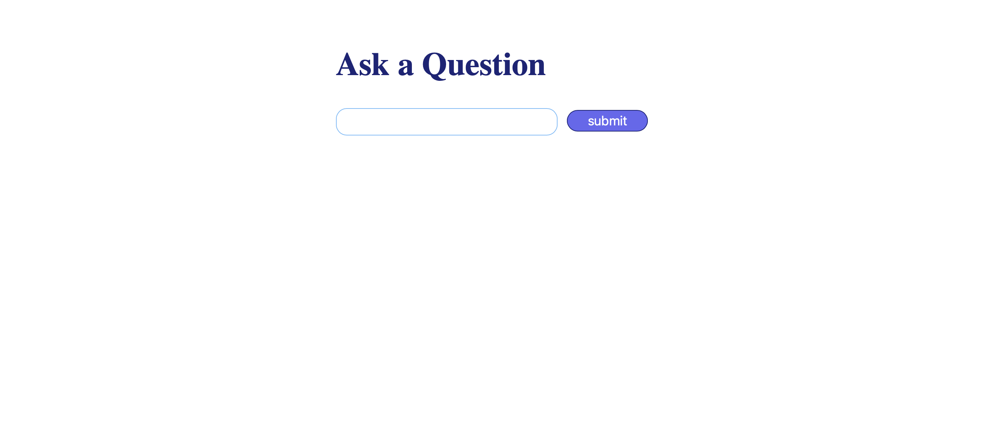
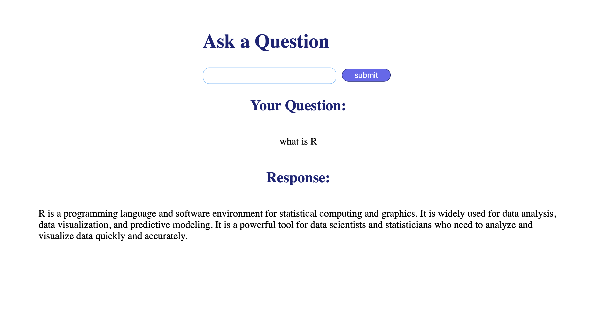

# Question and Response App
Simple question and response app  flask-python




## Installation
clone the project
```
git clone https://github.com/mays4/Question-response-openAI.git
```
install python3 virtual environment
```
python3 -m venv env
source env/bin/activate
```
Set up the keys in a .env file
```
OPENAI_API_KEY="your_api_key_here"
```
Set up the  secret keys in a .env file
```
SECRET_KEY="your_secret_key_here"
```
run the project


```
python app.py
```


#### Build with  HTML, Flask, OpenAI API, Langchain  
#### styled with CSS
